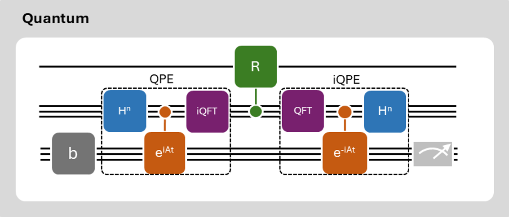

[](https://www.python.org/)
[](https://github.com/Qiskit/qiskit)
[](https://github.com/quantumapplicationlab/hhl-prototype/blob/main/LICENSE.txt)
[](https://github.com/psf/black)
[](https://github.com/quantumapplicationlab/hhl-prototype/actions/workflows/coverage.yml)
[](https://coveralls.io/github/QuantumApplicationLab/hhl-prototype?branch=main)



# HHL Quantum Linear Solver
The `hhl-prototype` allows to use the HHL algorithm to solve linear system of euqations. 
Original implementation was implemented by [@anedumla](https://github.com/anedumla) : https://github.com/anedumla/quantum_linear_solvers

## Installation
```python
git clone https://github.com/QuantumApplicationLab/hhl_prototype
cd hhl_prototype
pip install -e .
```

## Use

```python
import numpy as np
from hhl_prototype import HHL
from qiskit.primitives import Estimator, Sampler

# create the matrix
A = np.random.rand(4,4)
A = A+A.T

# create the right hand side 
b = np.random.rand(4)

# create the solver and solve
hhl = HHL(estimator=Estimator(), sampler=Sampler())
hhl.solve(A, b)
```


## Documentation
Tutorial: https://qiskit.org/textbook/ch-applications/hhl_tutorial.html
